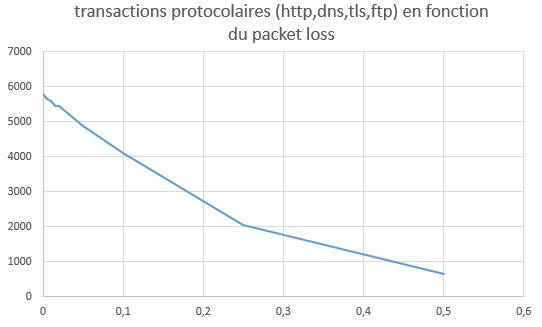
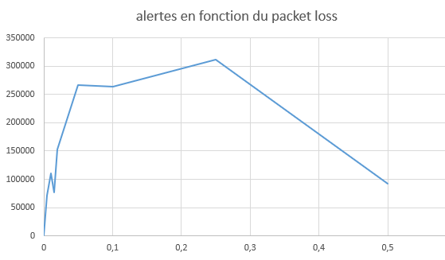
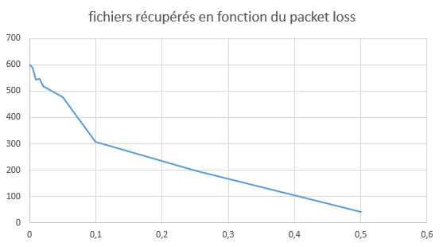

# Suricata-lab

## Analyse de l'influence de la perte de packets

### Capture du fichier pcap

le fichier pcap que j'ai généré fait 2 gigas et comporte différents types de protocoles ainsi que des échanges de fichiers.

J'ai capturé l'interface de ma carte wifi pour réalisé différentes actions:

- envoyé des requetes http à l'aide du site https://reqbin.com/req/yjok4snr/post-html-form-example

- visité des sites en http, dont ceux contenus dans ce lien https://superuser.com/questions/1213116/are-there-well-known-http-only-sites

- run nmap pour scanner les hosts présents sur mon réseau (wifi public)

- connecté dans un salon de discussion vocal discord

- ping

- envoyé des mails contenant des pièces jointes executables

- téléchargé des fichiers à l'aide de différents protocoles (ftp, http..) dont certains executables

- téléchargé des mises à jour

### Résultats

Pour le fichier original :
 - transactions protocolaires : 5785
 - alertes : 576
 - fichiers extraits : 602

Ci dessous des graphes comparatifs de ces 3 valeurs en fonction du pourcentage de packet loss calculés à partir de la moyenne de 3 samples générés par pourcentage demandé. 

Le nombre de transactions et de fichiers récupérés semble faire sens avec la diminution du nombre de packets. Cependant, le nombre d'alertes est inconsistant. Cela peut etre du aux paquets qui ont été retirés qui pouvaient être important pour reconstruire le flux tcp par exemple.

## Détéction en périphérie

Est-il possible d'écrire une signature alertant sur l'utilisation de nouveaux protocoles par IP_GW?

 Les datasets de Suricata ne peuvent être utilisés qu'avec des sticky buffers, capturant des champs spécifiques (comme http.user_agent, tls.sni, etc.) d'un paquet ou d'une session.

 Or il n'existe pas de sticky buffer intégré pour "protocoles" ou un champ qui listerait directement les protocoles observés sur un flux donné.

 Donc il n’est pas possible d’utiliser directement des datasets pour détecter les nouveaux protocoles. 
